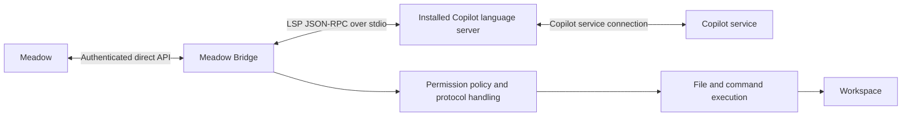

# Meadow Bridge candidate architecture

**Status:** Draft candidate; not an implementation specification or accepted ADR  
**Date:** 2026-09-23

## Purpose and scope

Meadow Bridge is the proposed name for a Copilot integration service that
connects Meadow to the installed `copilot-language-server` through its native
IDE interface. The service supplies workspace operations requested by Copilot
and preserves Meadow's session, operation, and completion boundaries.

The candidate uses the installed JetBrains plugin executable as a child
process with `--stdio`. Communication uses LSP-framed JSON-RPC and Copilot's
custom conversation and tool methods. It requires neither FFI nor a running
IDE UI. The Copilot connection has no Copilot CLI or MCP server dependency or
fallback. macOS and Windows 11 are supported-platform design requirements;
qualification remains specific to the executable and environment tested.

The first implementation uses an explicit `allow_all` policy and remains
fully non-interactive. Role-derived permission policies are an extension of
the same boundary, not part of the initial policy implementation. Interactive
approval dialogs and remembered user approvals are outside this design.

This document proposes the integration boundary and first delivery scope.
Existing accepted ADRs still govern production code. The repository, package,
and command have not been renamed by this document.

## Ownership



| Owner | Responsibility |
| --- | --- |
| Meadow | Workflow and actor orchestration; selected role/configuration; stable and invocation instructions; output contracts; Run-level recovery and durable Run evidence. |
| Bridge direct service | Authenticated admission; session and operation identities; policy binding; status reconciliation; completion and uncertainty reporting. |
| Bridge native client | Child lifecycle; LSP framing; native model/catalog and conversation methods; correlated progress and tool callbacks. |
| Bridge workspace tools | Validated file operations and non-interactive commands; policy enforcement; process/output ownership and effect settlement. |
| Copilot language server | Copilot authentication/service interaction; model invocation, conversation context, tool selection and result consumption; native built-in tools and its own policy decisions. |

The Bridge does not read actor definitions to discover permissions, assemble
workflow instructions, or select a role from its name. Meadow supplies those
inputs explicitly. Native method names remain inside the integration adapter.

## Direct API and session policy

The authenticated direct protocol is the reuse point. Preserve its explicit
workspace, generation pinning, operation identity, request fingerprinting,
bounded admission, and status reconciliation. The native route needs an
explicit new protocol version: current capabilities contain ACP-specific
evidence and a deny-only callback authority description. Native IDE evidence
cannot truthfully populate those fields.

The candidate adds a required permission-policy envelope to session creation.
An illustrative initial shape is:

```json
{
  "permission_policy": {
    "version": 1,
    "mode": "allow_all"
  }
}
```

The Bridge validates supported policy semantics, includes the policy in the
session-creation operation fingerprint, and acknowledges its digest. The
policy is fixed for that session. A missing or unsupported policy fails
admission rather than selecting an implicit permissive default. Policy
replacement requires a new session in the initial design.

Model IDs come from the installed server's advertised catalog. The request
selects a concrete model; the Bridge checks returned resolved-model evidence
and surfaces refusals or mismatches. A request echo is not independent proof
of remote model identity.

Session creation has an important semantic distinction: native
`conversation/create` starts inference. The proposed direct create operation
therefore allocates a Bridge session and validates its inputs without running
a placeholder prompt. Its acknowledgement does not claim that native context
already exists. The first prompt creates the native conversation; later
prompts use `conversation/turn`. The direct response/state schema must expose
this distinction before implementation.

Instruction placement preserves Meadow's existing ownership: the first native
turn receives the admitted stable layer together with the invocation input and
output contract. Later invocations receive their current input and contract;
corrections and continuations carry the admitted delta. Policy metadata and
evidence digests are control data, not model-facing instructions.

## Non-interactive permission handling

Two small modules separate policy semantics from protocol handling:

- **Permission policy:** evaluates a validated operation under the session's
  policy and returns allow or deny. Its initial implementation is `allow_all`.
- **Permission handling:** correlates confirmation requests, obtains the
  policy decision, returns the native protocol response, and records the
  decision. It has no user-input queue or waiting-for-user state.

The executor also checks policy on every actual invocation. Copilot can
auto-approve a tool and invoke it without a confirmation callback. A prior
confirmation is neither required for execution nor a substitute for checking
the actual invocation's identity and arguments.

`allow_all` grants local authorization for supported Bridge tools; it does
not disable request validation, workspace admission, resource limits, or
process cleanup. It does not override a Copilot refusal or establish that an
external policy authority has approved a tool. Native settings that disable
auto-approval can mean "ask the client" rather than "deny execution"; they
cannot substitute for the Bridge's policy decision.

For a later role-policy implementation, Meadow resolves effective permissions
from the selected deployed actor definition and applicable configuration.
The packaged `meadow/defaults/actors/` directory is one possible source, not
a path the Bridge assumes. Meadow sends structured policy data; the Bridge
does not parse Markdown or recover rules from prompt prose. An `ask` outcome
is resolved to deny, consistent with Meadow's existing non-interactive
OpenCode handling. Explicit deny is never converted to allow by the handler.

The eventual rule format must preserve supported ordering, defaults and
operation semantics. Command patterns need a defined interpretation; copying
strings does not establish OpenCode-equivalent shell handling. That extension
should specify its supported subset and reject unsupported semantics.

## Workspace tools and execution

The first registered client tools cover file creation, file editing and
command execution. Generic tool names avoid unintentionally selecting the
vendor's special edit wrappers, which can introduce another edit-generation
step. Final tool names and edit schemas belong in the implementation contract.

Every callback is bound to an admitted session and active operation using
native conversation, turn and tool-call identities. Unknown, stale or
conflicting invocations fail before effects. Duplicate invocation identities
cannot execute the same effect again; invocation identity is distinct from
the preceding confirmation request's RPC identity.

File operations validate paths and edit preconditions. Commands declare cwd
and an explicit execution form, with bounded duration, captured stdout/stderr,
exit status and owned process cleanup. The initial executor does not require
an IDE terminal or interactive stdin. Shell selection and quoting on each
platform remain a contract decision; the diagnostic's one fixed Python argv
does not establish general command support.

Native read/search tools remain server-owned unless explicitly replaced or
disabled. The Bridge's policy enforcement claim initially covers the tools
it executes, not every server-side effect. Before supporting a restrictive
role policy, the implementation must establish how it handles relevant native
tools outside that boundary. A workspace cwd is execution context, not an OS
sandbox; unrestricted command execution can reach anything permitted to its
process identity.

## Conversation and process lifecycle

The candidate retains one owned language-server process per Bridge workspace
and maps logical sessions to distinct native conversations. Different
conversations may progress independently once qualified; turns in one
conversation are serialized. The initial implementation does not introduce
a process pool or a pluggable collection of Copilot backends.

The first prompt records the operation and reserves its native correlation
identities before dispatch, so callbacks can be routed while
`conversation/create` is still pending. Native acknowledgements must agree
with that mapping. Repeating create with the same conversation ID can replace
context, and a repeated turn ID is not a native idempotency guarantee.
Response-loss reconciliation therefore belongs to the Bridge's operation
ledger, without reissuing possibly accepted inference or tool effects.

A successful turn requires a correlated ordinary result, clean terminal
progress, and settled client callbacks/effects. A normal RPC response can
coexist with terminal error progress. Native `end` or cancellation progress
can precede the completion of an already-running command.

Cancellation stops further admission for the operation, requests native
cancellation, and settles owned commands and filesystem work. Shutdown waits
for that settlement before reaping the language server. Cancellation cannot
undo effects that already happened. Unresolved settlement or generation loss
is reported as typed uncertainty, preserving known effect evidence and
preventing blind replay. The existing generation ledger does not promise
exactly-once execution across a Bridge restart.
Meadow's separately governed Run-level whole-turn recovery can create new
sessions and operations; it is distinct from replaying a Bridge operation.

Retirement settles outstanding work before destroying native context.
`conversation/destroy` removes in-memory context; it does not itself cancel
client-owned commands or delete persisted transcripts. Transparent restoration
is unsupported in the first implementation. Native transcript restoration
and compression need their own acceptance conditions before capability claims
are expanded; a reused identifier alone does not prove retained context.

## Reuse and coordinated changes

Use the existing direct service/state and configuration/discovery seams where
their semantics fit. Add a native LSP transport/client and the small policy,
permission-handling and workspace-execution boundaries. Protocol framing and
native callback semantics should not be forced into the existing ACP client.
This is a component boundary proposal, not a requirement to create a general
extension framework or a file for every responsibility.

| Existing authority or seam | Candidate treatment |
| --- | --- |
| [ADR-012: direct consumer protocol](../adrs/012-meadow-direct-consumer-protocol.md) | Retain identity, authentication and reconciliation principles; explicitly replace ACP-specific capabilities, model binding, session creation and callback authority for the new route. |
| [ADR-007: tool ownership](../adrs/007-tool-ownership.md) | Record native registered tools and client execution as a new decision; current ACP assumptions do not silently change. |
| [ADR-013: binary admission](../adrs/013-version-reported-binary-admission.md) | Reuse installed-binary discovery and version admission; qualify native methods independently of the version floor. |
| [ADR-016: diagnostic capture](../adrs/016-opt-in-raw-acp-event-capture.md) | Preserve explicit capture lifetime and truthful failure reporting; define a native format instead of fabricating ACP events. |
| Meadow `AUTHORITY.md`: `direct-substrate-contract`, `prompt-contract`, `effective-instruction-provenance` | Meadow owns amendments to normalized admission, instruction/policy presentation and evidence. This candidate does not redefine those contracts. |

Meadow's OpenCode path retains its native role and permission handling.
Meadow owns how future role policies are resolved and retained across actor
resets and Run resumes; the initial `allow_all` mode makes no claim that role
frontmatter restrictions are enforced by the native route.

The proposed public name is **Meadow Bridge**, with `meadow-bridge` as the
package/command and `meadow_bridge` as the Python package. Repository renaming,
configuration-path migration and command compatibility need one coordinated
delivery decision. They do not require a second runtime policy mechanism.
The current deprecated OpenCode-compatible API's disposition remains governed
by ADR-012 until explicitly amended.

## First delivery and evidence

The standalone [native IDE diagnostic](../experiments/native_ide_smoke/README.md)
and its [local validation record](../experiments/native_ide_smoke/VALIDATION.md)
establish bounded protocol/effect feasibility. They are not acceptance of the
production architecture. In particular, an empty `mcp/getTools` snapshot
observes the native manager's catalog; it is not an OS-level process guarantee
or evidence of centrally managed callback authorization.
Native lifecycle observations informing this draft are version-scoped
diagnostic inputs. Their implementation guarantees require qualification on
the selected native protocol, rather than relying on a version string alone.

The first delivery is one complete Meadow-to-Bridge-to-Copilot path: managed
startup, explicit model and `allow_all` session policy, retained role/body
instructions, real file/command callbacks, a second turn in the same native
conversation, and clean retirement. It also needs observable rejection and
settlement evidence for malformed/uncorrelated callbacks, duplicate effects,
permission-handler failures, command cancellation, and child loss. Concurrent
actors require separate-conversation isolation and no overlapping turns within
one conversation before parallel capability is advertised.

Acceptance includes the affected repositories' required gates and integrated
Meadow behavior, with preserved OpenCode behavior. The diagnostic alone does
not replace those checks. Supported-platform results identify the actual
executable/version and distinguish simulated boundaries from native execution.

## Decisions to close before implementation

1. New direct protocol identity, endpoint/version transition, and the session
   acknowledgement shape for deferred native creation.
2. File-edit preconditions, supported command/shell forms, output limits and
   cross-platform process-tree cancellation/settlement.
3. Which observed native tool, permission and continuity events are exposed
   through normalized evidence, and which remain unsupported capabilities.
4. The coordinated package/command/configuration rename and deprecated-API
   transition.

Role-rule translation, transparent recovery and compression controls remain
later increments. Their absence is explicit in initial capability reporting;
they are not reasons to introduce extra abstraction in the first delivery.
